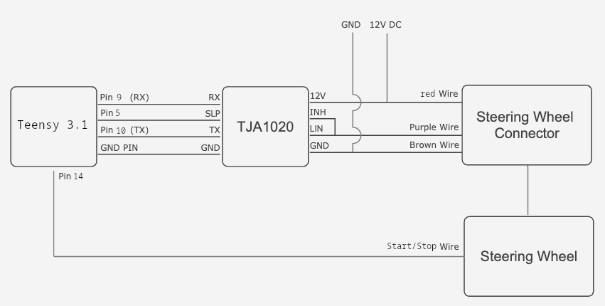

# Inspiration

Inspired by this project: https://github.com/riquenunes/vw-steering-wheel-gamepad/tree/main

# Cupra Steering Wheel Gamepad 🎮

This open-source project allows you to repurpose a Cupra steering wheel with LIN bus communication as a versatile gamepad for PC sim racing games and to use the media keys as these are exposed as an Keyboard too. By reverse engineering the steering wheel's LIN bus protocol, this project reads button presses, and transmits them as gamepad events and parallel as media keyboard buttons over USB.

**Note:** This project focuses on utilizing the steering wheel buttons as an input device. It does not provide analog steering wheel angle information or handle force feedback, as those functions are typically handled by a dedicated wheel base for sim racing.

This project can also serve as a foundation for adapting incompatible steering wheels in other vehicles, providing a starting point for custom solutions and expanding compatibility.

## Features

*   **Steering Wheel Integration**
    *   Reads button states from Cupra steering wheels with LIN bus communication, including models from VW, Audi, Skoda, and Seat with PQ24/PQ25 platforms (tested with a Cupra Leon steering wheel, compatibility with other models is likely but not guaranteed).
    *   Supports dedicated horn button for in-game actions.
    *   Supports dedicated Start/Stop Button for in-game actions. The Start/Stop button is not available on the LIN data.
*   **USB Capabilities**
    *   Transmits button presses by wire as a standard gamepad, compatible with PCs.
    *   Simulates two USB devices one gamepad and one keyboard.
*   **~~Backlight Control~~**
    *   ~~Provides 128 levels of brightness control for the steering wheel buttons' backlight.~~
*   **~~Reusable Components~~**
    *   ~~Modular design with well-defined components for easy integration into other projects or customization.~~

## How It Works

This project utilizes the LIN bus, a communication network in vehicles, to read button presses from the steering wheel. The Teensy microcontroller acts as the master node on the LIN bus, requesting and receiving data from the steering wheel (the slave node).

1.  **Button Press:** When you press a button on the steering wheel, the steering wheel module sends a data packet over the LIN bus.
2.  **Teensy Reads Data:** The Teensy, connected to the LIN bus via the LIN transceiver, receives and decodes this data packet.
3.  **USB Transmission:** The Teensy translates the button press into a standard gamepad event and transmits it over USB.
4.  **Game Action:** The receiving device (e.g., PC) recognizes the gamepad event and triggers the corresponding action in the game or application.
5.  **Windows/Linux Action:** The receiving device (e.g., PC) recognizes the keyboard event and triggers the corresponding action in the operating system (e.g. volume increase/decrease, next/previous track, mute/play)

## Parts Used

| Part                    | Description                                                                     | Part Number |
|-------------------------|---------------------------------------------------------------------------------|-------------|
| Steering Wheel          | Cupra Leon steering wheel with buttons and with paddles                            | 5FA.419 091.FKXEY |
| LIN Transceiver         | TJA1020, TJA1021, or SIT1021T ([I used this one from AliExpress](https://pt.aliexpress.com/item/1005006348508612.html))                                                 | -            |
| Teensy 3.1/4.0          | Any Teensy 3.1/4.0 development board                                    | -            |

## Wiring Diagram

Please note that the wiring diagram is based on my specific setup. The wiring may be different depending on the steering wheel model or MCU board used.

I have to make a better wiring diagram as there are two red and two grey wires and I only used one of each.

## LIN Protocol

The steering wheel communicates using LIN frames. Here's a breakdown of the relevant frames, obtained through reverse engineering:

| Frame ID | Type             | Description                          | Size | Byte 0                                     | Byte 1                                 | Byte 5                                         |
|----------|------------------|--------------------------------------|------|------------------------------------------|-----------------------------------------|-------------------------------------------------|
please read the code I have right now no motivation to document it.

**Button Mapping**

please read the code I have right now no motivation to document it.

## missing Features (eventually these would never be implemented as it works good enough)
- [ ] Restructure to reusable code structure - right now only "spaghetti" code
- [ ] Find out which particular sendMasterRequestBlocking ID is the right one to switch the steering wheel to "output button presses mode" right now its only bruteforcing every possible adress
- [ ] Find out how to change backlight brightness levels
- [ ] Backlight control
- [ ] Airbag deployment based on in-game collisions for added immersion